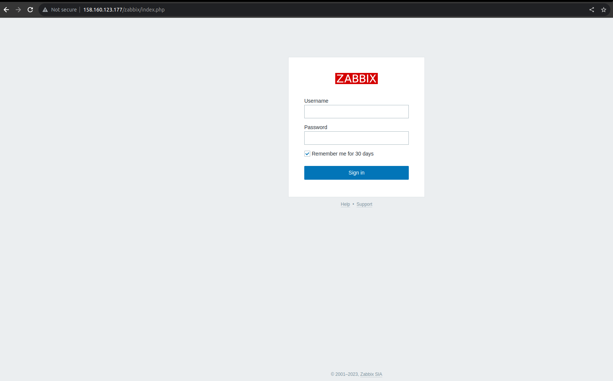
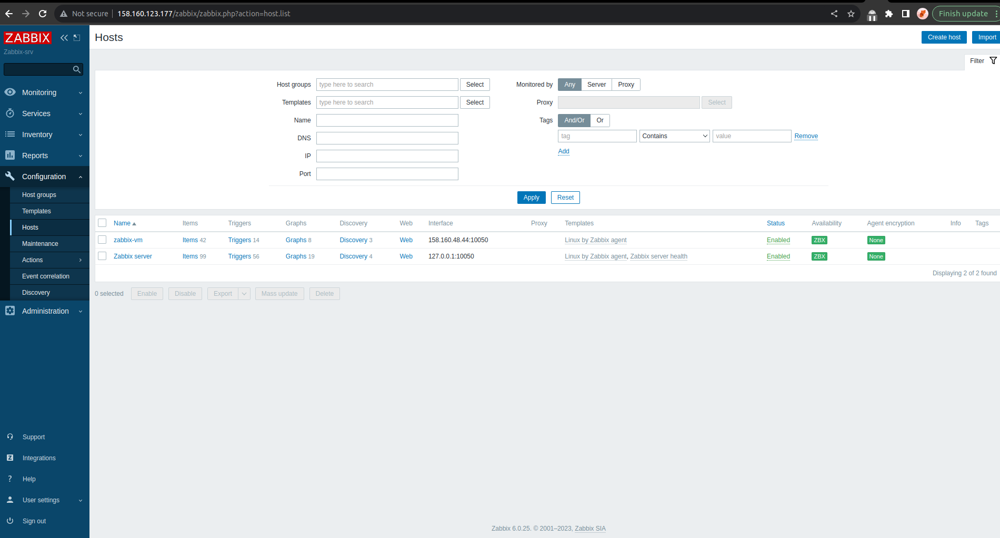
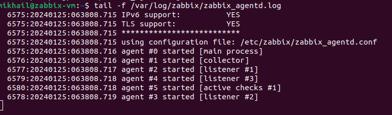
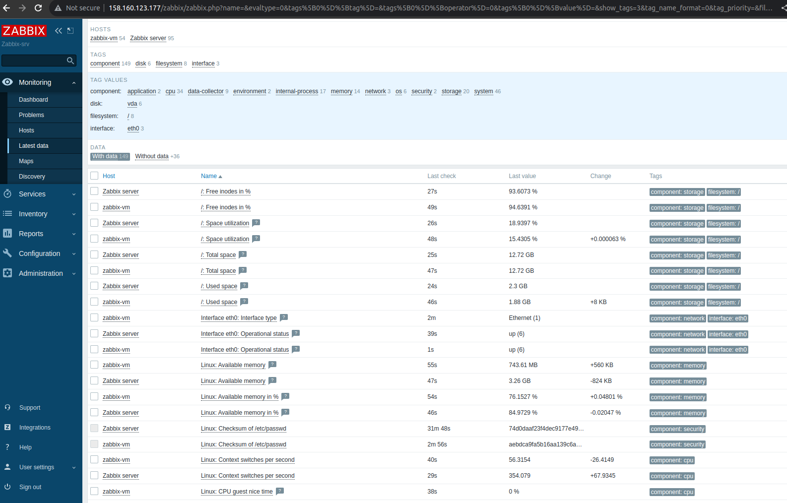

# Домашнее задание к занятию "`Система мониторинга Zabbix`" - `Байков Михаил`


---

### Задание 1 

Установите Zabbix Server с веб-интерфейсом.

#### Процесс выполнения
1. Выполняя ДЗ, сверяйтесь с процессом отражённым в записи лекции.
2. Установите PostgreSQL. Для установки достаточна та версия, что есть в системном репозитороии Debian 11.
3. Пользуясь конфигуратором команд с официального сайта, составьте набор команд для установки последней версии Zabbix с поддержкой PostgreSQL и Apache.
4. Выполните все необходимые команды для установки Zabbix Server и Zabbix Web Server.

#### Требования к результаты 
1. Прикрепите в файл README.md скриншот авторизации в админке.
2. Приложите в файл README.md текст использованных команд в GitHub.


### Решение 1 
1. 
2. ```
    1  sudo apt update && sudo apt upgrade
    2  wget https://repo.zabbix.com/zabbix/6.0/debian/pool/main/z/zabbix-release/zabbix-release_6.0-4+debian11_all.deb
    3  dpkg -i zabbix-release_6.0-4+debian11_all.deb
    4  sudo dpkg -i zabbix-release_6.0-4+debian11_all.deb
    5  sudo apt update
    6  sudo apt install zabbix-server-pgsql zabbix-frontend-php php7.4-pgsql zabbix-apache-conf zabbix-sql-scripts zabbix-agent
    7  apt-cache search postgresql
    8  sudo apt install postgresql
    9  sudo -u postgres createuser --pwprompt zabbix
   10  sudo -u postgres createdb -O zabbix zabbix
   11  sudo systemctl status postgresql
   12  zcat /usr/share/zabbix-sql-scripts/postgresql/server.sql.gz | sudo -u zabbix psql zabbix
   13  sudo nano /etc/zabbix/zabbix_server.conf 
   14  sudo sed -i 's/# DBPassword=/DBPassword=******/g' /etc/zabbix/zabbix_server.conf
   15  grep DBPassword /etc/zabbix/zabbix_server.conf 
   16  sudo grep DBPassword /etc/zabbix/zabbix_server.conf 
   17  sudo systemctl restart zabbix-server zabbix-agent apache2
   18  systemctl enable zabbix-server zabbix-agent apache2
   19  sudo systemctl enable zabbix-server zabbix-agent apache2
   20  history


---

### Задание 2 

Установите Zabbix Agent на два хоста.

#### Процесс выполнения
1. Выполняя ДЗ, сверяйтесь с процессом отражённым в записи лекции.
2. Установите Zabbix Agent на 2 вирт.машины, одной из них может быть ваш Zabbix Server.
3. Добавьте Zabbix Server в список разрешенных серверов ваших Zabbix Agentов.
4. Добавьте Zabbix Agentов в раздел Configuration > Hosts вашего Zabbix Servera.
5. Проверьте, что в разделе Latest Data начали появляться данные с добавленных агентов.

#### Требования к результаты 
1. Приложите в файл README.md скриншот раздела Configuration > Hosts, где видно, что агенты подключены к серверу
2. Приложите в файл README.md скриншот лога zabbix agent, где видно, что он работает с сервером
3. Приложите в файл README.md скриншот раздела Monitoring > Latest data для обоих хостов, где видны поступающие от агентов данные.
4. Приложите в файл README.md текст использованных команд в GitHub

### Решение 2
1. 
2. 
3. 
4. ```
    1  sudo apt update && sudo apt upgrade -y
    2  wget https://repo.zabbix.com/zabbix/6.0/debian/pool/main/z/zabbix-release/zabbix-release_6.0-4+debian11_all.deb
    3  sudo dpkg -i zabbix-release_6.0-4+debian11_all.deb
    4  sudo apt update && sudo apt install zabbix-agent -y
    5  sudo systemctl enable zabbix-agent
    6  sudo systemctl start zabbix-agent
    7  sudo systemctl status zabbix-agent
    8  sudo nano /etc/zabbix/zabbix_agentd.conf 
    9  sudo systemctl restart zabbix-agent
   10  tail -f /var/log/zabbix/zabbix_agentd.log 
   11  sudo nano /etc/zabbix/zabbix_agentd.conf 
   12  sudo systemctl restart zabbix-agent
   13  tail -f /var/log/zabbix/zabbix_agentd.log 
   14  history

---

